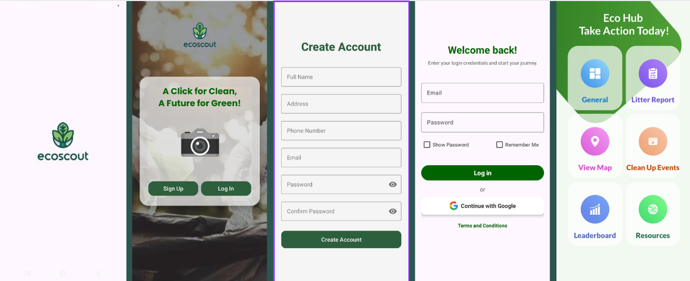

# 🌿 **EcoScout: Litter Detection and Cleanup Coordination**  
**"A Click for Clean, A Future for Green"**  

---

## 📜 **Overview**  
EcoScout is a mobile application designed to empower individuals in the fight against pollution. It helps users report litter, join community clean-up events, and track their environmental contributions. The app makes sustainability fun and engaging by gamifying the cleanup process with points, badges, and rankings. 🌍💚

### **Key Features**:
- **Report Litter**: Submit litter reports by uploading images and tagging locations.
- **Clean-Up Events**: Discover and participate in local clean-up events.
- **Community Engagement**: Earn points, unlock badges, and track your progress on the leaderboard.
- **Educational Resources**: Access waste disposal guides and local recycling information.

---

## 🚀 **Features**  

### 1. **Signup & Login** 🔐  
The first step is to create an account or log in to EcoScout.  
#### **Signup**:  
- Users fill in their details:
  - 📝 **Full Name**  
  - 🏠 **Address**  
  - 📞 **Phone Number**  
  - 📧 **Email**  
  - 🔑 **Password**  
- **Agree to Terms and Conditions**: Users must agree to the terms before accessing the app.  
- Once completed, you can proceed to the home screen.  

#### **Login**:  
- Users can log in using:
  - **Credentials** (email and password)  
  - **Google Login** 🔗 for quick access  
- **Additional Options**:  
  - 👁️ **Show Password**: Make your password visible while logging in.  
  - 🔄 **Remember Me**: Stay logged in for future visits.  

---

### 2. **Dashboard / Home Screen** 🏠  
The dashboard is the central hub of EcoScout where users can take action, track progress, and access resources.  
#### **Sections of the Dashboard**:  
- **Profile Management**:
  - Update personal information 📑, view contribution history 📊, and unlock badges 🏆.  
  - Example badges:
    - 🐣 **Eco Newbie** (50 points)
    - 🦸‍♂️ **Litter Legend** (500 points)  
- **Quick Navigation**: Easily navigate between sections via an intuitive design.  
- **Real-Time Updates**: Track points, reports, and community events as they occur.  
- **Impact Tracking**: See a summary of your contributions directly from the dashboard.  

---

### 3. **Litter Report** 🗑️  
Take an active role in reporting litter:  
- **Report Submission**:  
  - 📸 Upload images of litter using the app’s built-in camera or from your device’s gallery.  
  - 🗂️ Select the type of litter (e.g., plastic, paper, hazardous waste).  
  - 🌍 Tag the litter's location on an interactive map.  
- **Points**:  
  - **Standard Litter**: +10 points  
  - **Hazardous Litter**: +20 points  
- **Submitted Reports**:  
  - Reports are logged in your profile to showcase your contribution to environmental sustainability.  

---

### 4. **Interactive Map** 🗺️  
Explore the map showing the litter locations reported by the community:  
- **Zoom In/Out** to see pollution hotspots near you.  
- 📍 **Identify Nearby Locations** where you can take immediate action.  

---

### 5. **Clean-Up Events** 🧹  
Find and join clean-up events in your area:  
- **Event Listings**:  
  - View event details (time, location, organizer).  
  - 📅 **Register** for events directly through the app.  
- **Earn Points** for attending events, with bonus points for frequent participation.  
- **Attendance History**: Updates your profile with attended events and contributions.  

---

### 6. **Leaderboard** 🏅  
- **Rankings**:  
  - Compete with other users based on the points you’ve earned.  
  - 🏆 Track your position and see who’s leading in your community.  
- **Exclusive Badges**: Unlock special badges as you climb the ranks.  

---

### 7. **Educational Resources** 📚  
EcoScout also offers resources to educate users on proper waste management:  
- **Waste Disposal Guide**: Learn how to dispose of different types of waste correctly.  
- **Waste Sorting Tutorial**: Understand how to sort waste effectively.  
- **Local Disposal Centers**: Find nearby centers for responsible waste disposal.  

---

## 🤝 **How You Can Contribute**  
EcoScout thrives on community collaboration. Here’s how you can help:  
- **Report Litter**: Upload images of litter and tag locations. 📸  
- **Join Clean-Up Events**: Attend local clean-ups and help make your community cleaner. 🧹  
- **Share Knowledge**: Use the educational resources to spread awareness about waste management. 🌱  

---

## 👥 **Developer Team**  
The development team behind EcoScout:

| **Developer** | **Role**                  | **Contact**           |
|---------------|---------------------------|-----------------------|
|    **Armedilla, Reina Liz B.**  | Frontend Developer       | 22-06939@g.batstate-u.edu.ph |
|    **Perez, Stephanie I.**  | Fullstack/Project Manager | 22-05252@g.batstate-u.edu.ph |
|    **Mendoza, Faith Allyson R.**  | Backend Developer        | 22-05861@g.batstate-u.edu.ph | 

---

## 📧 **Support**  
For any questions or support, contact us at:  
📧 **support@ecoscout.com**  

---

## 🌍 **Let’s Create a Cleaner World Together!**  
EcoScout combines technology with community action to reduce litter and pollution. By participating, you're not just cleaning your surroundings—you’re helping to create a sustainable future. 🌱
